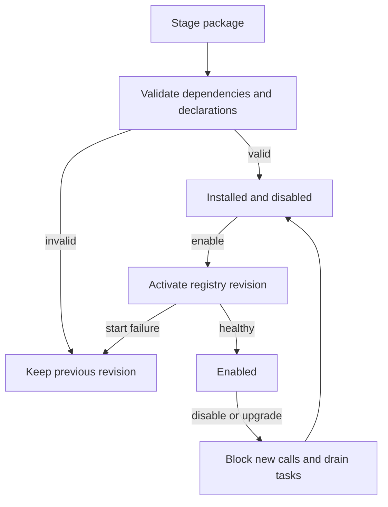

# Pluginize the Praxis application

Status: migration started; the roadmap baseline is merged main `a037f21`.
The [first implementation slice](../docs/PLUGIN_RUNTIME.md) adds shared tool
ownership and dispatch. The [progress checklist](README.md) records PR 1's
completed native foundation. A native background-service host and core event/template services
are now implemented, along with task registry snapshots, receipt revision
evidence and provider-independent management with lazy clients. Native feature
invocation API v1 adds host-issued identity/workspace, scoped storage and
credentials, deadline/cancellation handling and contracted service-backed tools.
The headless VM adapter is now an optional native crate with explicit host
configuration, native service ownership, guest-scoped results and credential
grants. A compatibility installation preset preserves the shipped distribution.
The VM also supports an installed headless worker through process protocol v1,
with handshake/health, caller scope, deadlines, cancellation and crash handling.
VM routes/UI, standalone CLI and screenshot delivery are package-owned as well.
Manifest v2, generic process declarations, guest ownership/recovery and
minimal startup below remain implementation targets.

## 1. Decision and scope

Start with VM support, then the dashboard, then the remaining feature tools.
This is a useful order: VMs exercise services, effects, configuration and assets;
the dashboard then exercises routes, events and UI contributions. Those two
extractions establish the interfaces needed by most other features.

Keep a small trusted runtime. It loads packages, authenticates callers, runs
tasks/state machines, applies permissions and verifies execution receipts.
Plugins supply features through those interfaces. A plugin may request an
operation or declare a contract; it cannot mark its own output as a verified
runtime receipt, change the operator-selected workspace or bypass a guard.

POML rendering, context data and state-machine execution stay in the runtime.
They must work with an empty feature-plugin registry and without the dashboard.
Local `templates/` and `contexts/` remain supported; optional workflow packs
supply additional assets. Full POML rendering still requires Node/POML_CLI.
Workflows that declare plugin capabilities fail setup when those owners are
missing; the interpreter must not invent replacements or accept claimed facts.

Move **the entire dashboard UI** into a plugin: login UI, navigation, chat,
Graphs, Messages, configuration and plugin-management pages. Authentication,
graph parsing, message storage and telemetry remain host services usable by
other clients. No mandatory dashboard shell remains in the minimal runtime.

Retain only three builtin tools in `file_ops`. All other model-facing tools,
including wrappers around runtime control, become package contributions. Keep
the existing standard experience through a compatibility preset; provide an
explicit minimal distribution without starting optional features.

## 2. What exists and what must change

Today's `src/plugins/mod.rs` loads tool manifests with builtin, HTTP, script,
verification, source-edit and host-bound native service handlers. Plugins can declare action contracts,
context defaults, secrets and enabled state. This is a useful starting point,
but manifests alone do not register providers, service processes, routes, UI pages or
workflow/template packages. A manifest referring to a Rust builtin still leaves
that implementation compiled into Praxis.

Coupling identified at the roadmap baseline:

| Current location | Coupling | Required seam |
| --- | --- | --- |
| `src/main.rs` | Starts the VM manager/autostart and calls VM CLI handlers | Package lifecycle and CLI contributions |
| `src/tools/vm_tools.rs` | Global manager and configuration/user fallbacks | VM service handle with authenticated caller scope |
| `src/gateway/agent_loop.rs` | VM terminal/file redirection and automatic screenshots | Explicit execution backend and optional hooks |
| `src/dashboard/routes.rs` | Template sync, runtime administration and feature endpoints mixed together | Host asset/admin APIs plus package-owned routes |
| `src/dashboard/stream.rs` | Core modules import dashboard event delivery | Runtime event bus and dashboard stream adapter |
| `src/gateway/{message_handler,agent_loop,ws_handler}.rs` | Repeated builtin dispatch branches | One dispatcher for every ingress path and IR |
| `src/db/tools.rs`, `src/tools/registry.rs` | Builtin defaults and static catalog | Installed/enabled owner registry with legacy aliases |
| `PluginRegistry::manages_contract` | Builtin names and every `vm_` name excluded | Explicit ownership; reserve only actual kernel tools |
| `src/gateway/mod.rs` | Native workers have separate lifecycle registrations; management starts without provider setup | Packaged feature services and independent core housekeeping |
| `src/lib.rs`, `Cargo.toml`, `src/assets.rs` | Feature modules, dependencies and assets remain unconditional | Optional crates, package assets and a minimal build |

Move behavior as well as names. An absent plugin must contribute no tools,
workers, routes, assets, imports or mandatory heavy dependencies.

The first slice now routes chat/agent/IR execution through `tool_dispatch.rs`
and uses `tools/catalog.rs` for owner validation. WebSocket tasks already enter
through these message paths. Explicit native names replace the blanket `vm_`
reservation. The VM adapter now binds the optional `praxis-vm` crate through that
seam; dashboard/delivery bridges still remain for PR 3. This is native feature
extraction, not completed independent IPC or minimal-runtime packaging.

`src/runtime/events.rs` now owns the user stream; the dashboard stream module is
a compatibility re-export. `src/runtime/templates.rs` owns resolution/catalog
sync, retaining operator metadata. Core retention, cron and shell cleanup have
separate workers under the native service host, with bounded disable/shutdown.

## 3. Runtime boundary and builtin file operations

| Remains in the trusted runtime | Supplied by plugins |
| --- | --- |
| Bootstrap CLI, health, plugin administration and configuration loading | Optional clients, onboarding UI and feature CLI commands |
| Authentication, pairing, user/session identity and permission grants | Dashboard, Discord and other channel frontends |
| Registry, dependency validation and package lifecycle | Tools, providers, services, routes and UI contributions |
| Task engine, POML/context runtime, SM/Decision IR interpretation and guards | Additional workflow/template/persona packs and Decision profiles |
| Workspace resolver, resource locks, execution journal and receipt store | Language-specific build/test/source contracts and verifiers |
| Cancellation, budgets, compaction policy, retries and audit | Provider transport/protocol implementations |
| Scoped storage/secrets, events, usage and asset APIs | Memory, RAG, learning, cron, skills, media and VM features |
| Minimal `file_ops` implementation | Shell execution and legacy file helpers |

The builtin target is:

| Tool | Target semantics |
| --- | --- |
| `inspect_file` | Read a bounded regular file inside the selected workspace and return its actual hash |
| `write_file` | Transactional create/replace using an expected-absence or expected-hash precondition |
| `apply_patch` | Transactional existing-file modification with checked preconditions and recovery |

Current `write_file` is a raw write that can create parent directories; it does
**not** already implement the target contract. Introduce a versioned schema and
compatibility adapter rather than silently changing existing calls. Workspace
confinement must account for symlinks, path replacement and concurrent writes.
These primitives verify file effects, not Rust correctness. Formatting, builds
and tests belong to installed capability contracts such as `verified_rust`.

The management CLI/API works without `runtime_control`. That plugin exposes
`execute_decision`, discovery, context and navigation tools to the model using
host-owned operations. Its absence removes those tools, not the runtime's
ability to enforce guards. `set_context` and `agent_set_path` retain existing
authority restrictions; parameters cannot grant workspace or workflow access.

## 4. Complete builtin-tool migration map

The current default catalog has 73 tools: 68 literal definitions and five
factory definitions in `src/db/tools.rs`. Each appears once below. Names remain
compatibility aliases when ownership moves; new installations use explicit
package ownership. Preserve disabled flags instead of re-enabling migrated tools.

| Target owner | Existing tool names |
| --- | --- |
| builtin `file_ops` | `inspect_file`, `write_file`, `apply_patch` |
| `legacy_file_ops` | `read_file`, `edit_file` |
| `runtime_control` | `search_tools`, `execute_decision`, `read_tool_result`, `get_context`, `set_context`, `delete_context`, `agent_next`, `agent_back`, `agent_complete`, `agent_set_path`, `agent_feedback`, `run_check` |
| `shell` | `execute_terminal`, `run_background`, `background_status` |
| `delegation` | `delegate_task`, `list_delegations` |
| `memory` | `memory_profile_load`, `memory_profile_create`, `memory_profile_list`, `memory_get`, `memory_set`, `learn_fact`, `learn_preference`, `learn_topic` |
| `rag` | `rag_search`, `rag_ingest`, `rag_list`, `rag_delete` |
| `cron` | `cron_add`, `cron_delete`, `cron_list`, `cron_toggle`, `cron_run` |
| `discord` | `discord_upload_file`, `discord_send_message`, `discord_send_embed` |
| `vision` | `understand_image` |
| `interaction` | `send_screenshot`, `ask_questions` |
| `skills` | `search_skills`, `use_skill` |
| `workflow_authoring` | `update_template` |
| `vm` | `vm_start`, `vm_stop`, `vm_shell`, `vm_keys`, `vm_input`, `vm_screenshot`, `vm_file_transfer`, `vm_snapshot`, `vm_shared_folder`, `vm_mouse`, `vm_look_screenshot`, `vm_process_list`, `vm_file_read`, `vm_network_test`, `vm_service_list`, `vm_package_install`, `vm_snapshot_list`, `vm_snapshot_restore`, `vm_snapshot_delete`, `vm_wait_for_text`, `vm_window_list`, `vm_window_focus`, `vm_clipboard_set`, `vm_clipboard_get`, `vm_install` |

`send_screenshot` composes capture and channel delivery: resolve an installed
capture capability and an authorized delivery adapter. It must report a missing
dependency explicitly. Interaction without screenshots must still work without
VMs. Runtime control must not depend on shell, dashboard or memory.

Keep existing installed manifests working: `brave_search`, `comfyui`,
`elevenlabs_tts`, `mimo_understand`, `openrouter_image`, `sosse`, `spotify` and
`system_info`. The example `verified_rust` owner must retain its identifier,
contracts and receipt identity; moving assets must not invalidate guard targets.
Replace `src/plugins/minimax_image.rs` builtin dispatch with a real package
adapter as part of media extraction.

## 5. App-wide module and asset ownership

Some directories need splitting rather than moving wholesale:

| Current area | Target ownership and migration |
| --- | --- |
| `crates/praxis-vm/`, `crates/praxis-vm-web/`, `plugins/vm/novnc/` | `vm` service/tools/configuration/guest adapters; include noVNC licenses and assets |
| `src/dashboard/`, `static/index.html`, styles and dashboard JS | `dashboard` UI/listener; move reusable APIs, graph/event semantics and template sync to host services first |
| `src/gateway/llm/`, `providers.rs`, `decision_client.rs` | Provider-neutral request/stream/usage/error interfaces in host; protocol implementations in provider packages |
| `decision_routing.rs`, `decision_profiles.rs`, `decisions/` | Routing enforcement/profile validation in host; profile assets and Decision protocol adapters in packages |
| `src/tools/execute_terminal.rs` | `shell` with its background-process cleanup worker |
| `src/gateway/delegation.rs` | `delegation` orchestration tools; task ownership, limits and authorization remain host |
| `src/tools/memory.rs`, `src/db/memory*.rs` | `memory` operations/migrations through scoped storage; host retains session/messages/auth/receipts |
| `src/tools/rag_*`, vector storage and embedding adapters | `rag` plus selected embedding-provider package |
| `src/gateway/cron_scheduler.rs`, `src/db/cron_jobs.rs` | `cron` service, tools and owned migrations; host retention remains independent |
| `src/discord/`, Discord tool implementations | `discord` channel/plugin with pairing and delivery adapters |
| `src/voice/`, `src/comfyui/`, `src/gpu_router.rs`, audio integrations | Separate voice/media/provider services; enable downloads, devices and paid requests only when configured |
| `src/skills/` and `skills/` | `skills` executor/catalog and separately installable skill assets |
| POML rendering, context handling, template authoring, `templates/`, `contexts/` | POML/context/SM engines and local assets remain core; `workflow_authoring` and optional coding/learning/persona packs add tools/assets |
| `src/tui/`, `src/context_cmd.rs`, `src/onboard.rs` | Optional TUI/client and onboarding/preset packages; retain core plugin-management CLI |
| `src/assets.rs` | Package-local assets plus bootstrap assets; preserve repair backups and operator edits |
| `src/config.rs`, DB connection/migrations, secrets and pairings | Shared host infrastructure; feature fields/migrations move to namespaced plugin schemas |
| `src/sm.rs`, tags, HTTP/WS ingress, task/contract/workspace services | Shared interpretation and client protocol semantics remain host; optional rendering/delivery adapters use them |
| `src/branding.rs` | Shared Praxis attribution helper; provider packages preserve Praxis / `https://getpraxis.boo` where supported |

Do not hand a plugin the whole database or global secret store. Give it scoped
storage methods, declared secret grants and migration ownership. User/session
isolation, compare-and-swap behavior and existing learning-profile namespaces
remain intact. Template text is content, not permission to change host policy.

## 6. Package and host API

Introduce a versioned manifest alongside today's tool manifest. The following
is a **proposed v2 example, not accepted by the current installer**:

```json
{
  "manifest_version": 2,
  "id": "vm",
  "version": "1.0.0",
  "requires": {"runtime_api": "2", "plugins": []},
  "service": {"adapter": "sidecar", "executable": "bin/praxis_vm"},
  "provides": {
    "tools": "tools.json",
    "routes": [{"namespace": "vm", "definition": "routes.json"}],
    "ui": [{"slot": "navigation", "id": "vm", "entry": "ui/index.html"}],
    "assets": ["ui", "novnc"],
    "config_schema": "config.schema.json"
  },
  "permissions": {
    "workspace": "operator_granted",
    "storage": ["vm", "shared"],
    "processes": ["qemu-system-x86_64", "qemu-img"],
    "network": [],
    "credential_keys": []
  }
}
```

Tool schemas/contracts are declared data, validated before registration.
Services additionally declare health/start/stop/cancellation behavior; routes
declare method, permission and resource scope. Asset/workflow references have
package ownership and content hashes. Required package versions must resolve
without cycles or duplicate tool/route owners. Optional UI contributions do not
create a VM dependency on the dashboard.

Use a bounded, versioned local IPC protocol for Rust sidecars rather than a
dynamic Rust-library ABI. Start with a native adapter to make extraction
reviewable, then package the same service behind IPC. HTTP/script plugins stay
supported. A native adapter is a migration seam, not the final proof that users
can install the feature without rebuilding Praxis.

The host issues the execution envelope: authenticated user/session/task,
execution ID, package revision, allowed resources, deadline, cancellation and
secret grants. Tool parameters cannot supply that authority. Responses contain
structured results, observed effects and verifier evidence. The host owns
contract evaluation, freshness checks, journals and receipt issuance. Unknown
methods, excessive output and late/cancelled responses fail explicitly.

Enforcement of process/network/filesystem isolation is separate from contracts.
Until an enforceable sandbox is delivered, installed executables/scripts remain
operator-trusted. Document effective enforcement instead of treating a manifest
permission list or sidecar boundary as a sandbox.

Proposed source layout: keep loading/lifecycle in `src/plugins/`, extract shared
services into `src/runtime/`, put IPC/types in `crates/praxis_plugin_api`, and
feature implementations in `crates/praxis_vm_plugin` and similar optional crates.
Distribution packages contain their manifest, executable and assets; existing
`plugins/` remains the installation directory. These directories are future
structure, not required setup paths today.

## 7. Package lifecycle

Install, enable and service startup are distinct operations. Installing a VM
package must not launch QEMU. An operator explicitly chooses activation and any
autostart policy.



Stage/checksum/validate before atomically publishing a registry revision. Pin
the contract/workflow/package revisions used by each task. Disable checks remain
live: no new effects may start through a disabled package, even for a pinned
task. Define draining/cancellation and bounded shutdown before activation ships.
Do not hot-swap a verifier or grant additional authority to an active task.

Keep previous binaries/assets/registry metadata for failed activation recovery.
Plugin-owned schema upgrades need reversible migrations or an explicit restore
plan; rolling back a manifest alone does not undo database changes. Uninstall
preserves data by default. Purging VM disks, memory or credentials is a separate
operator operation. Journal interrupted effects for recovery without replaying
an already committed operation.

## 8. Ordered implementation PRs

### PR 1 — shared registry and dispatch seam

- Build one owner catalog from kernel tools and installed packages. Replace
  blanket builtin/`vm_` reservations with explicit ownership and reject conflicts.
- Route chat, agent, WebSocket and Decision IR tool execution through one
  dispatcher; preserve charge-on-attempt, cancellation, output archival and
  existing guard checks. Discovery lists permitted enabled tools; it cannot
  install, enable or grant permissions.
- Introduce the smallest service/context-handle API needed by a VM adapter.
  Keep the existing guarded core navigation/context APIs authoritative; expose
  their scoped host-control adapter when packaging the wrappers in PR 5.
  Validate native versions and required bindings before provider requests or effects.
- Separate runtime events, template/catalog sync and retention from dashboard,
  cron and shell imports. Defer provider initialization: plugin administration
  and health must work with no configured inference provider.

Acceptance: existing workflows/plugins dispatch identically; a fixture service
can register/disable without UI, QEMU or a provider; duplicate owners and missing
required dependencies fail before inference. Do not build every extension type
before moving the first feature.

### PR 2 — headless VM adapter extraction

- Move QEMU/QMP/serial operations and all 25 VM tools behind one VM service.
  Inject configuration, scoped storage and authenticated identity instead of
  global manager/user fallbacks. Remove VM startup/CLI logic from `main` into
  contributed commands/lifecycle hooks.
- Replace implicit `VM_MODE` branches in core terminal/file tools with an
  explicit selected backend. A guest operation returns guest-scoped evidence;
  a host workspace receipt cannot claim a guest file changed.
- Move auto-screenshot behavior to an optional VM hook. Replace blanket secret
  injection from `secrets_inject.rs` with explicit per-VM credential grants.
- Preserve configured compatibility autostart; minimal mode creates no VM
  directories, starts no QEMU and does not enable tools on behalf of the model.

Acceptance: VM tools/CLI work headlessly; disabled VM contributes no calls/hooks;
existing disks/shared folders remain usable. This initial optional native crate
is transitional while PR 3 establishes independently installable hosting.

### PR 3 — independently packaged VM service and UI contribution

- Package the VM service executable using the versioned IPC interface, with
  health, deadlines, cancellation and restart/recovery handling.
- Move VM routes, VNC/WebSocket handling and noVNC assets into the VM package.
  Apply host authentication and VM ownership consistently, including legacy
  VNC aliases; retain aliases through an authenticated adapter.
- Contribute a VM page to optional dashboard extension slots. The VM service
  must run without dashboard installation; dashboard absence hides only UI.
- Implement disable/drain/upgrade policy for active VM sessions. Do not
  implicitly kill guests or delete their disks during uninstall.

Acceptance: VM installs without rebuilding the runtime, is absent from a minimal
dependency tree, and supports headless and dashboard combinations. Preserve
`DATA_DIR/vm` and `DATA_DIR/shared` or migrate them explicitly with recovery.
VM shell/network/package-install effects are not generally reversible. Record
partial/uncompensated outcomes; do not claim that restoring a VM snapshot undoes
external network effects.

### PR 4 — optional dashboard

- Extract reusable administration/session/chat/graph/receipt/usage APIs from
  dashboard routes into host services. Move template synchronization first so
  a headless runtime still discovers workflow assets.
- Package the whole UI, listener/TLS integration and stream client. Preserve
  Graphs parsing and active-node updates, branching `agent_next`/`agent_back`,
  state-local IR tables, Messages prompts/changes/token limits, generation speed
  and compaction telemetry. Read actual host state; do not add a second parser.
- Add registered navigation/page slots for feature plugins. Hide absent feature
  pages or explain installation; never start VM/media services just to draw UI.
- Preserve the existing default dashboard `0.0.0.0:1337` and separate gateway
  `0.0.0.0:3537`. Route adapters preserve client URLs and authentication; this
  migration does not merge listeners or change configured ports.

Acceptance: dashboard works with VM absent and provider setup incomplete; a
runtime without dashboard still supports CLI/API tasks and verified workflows.
No core import references dashboard streaming/templates. First-party dashboard
code remains trusted; third-party pages use isolated UI surfaces and a scoped
host bridge rather than arbitrary privileged same-origin JavaScript.

### PR 5 — remaining tool packages

Implementation extraction has started with `legacy_file_ops`: its read/edit
code lives in `crates/praxis-legacy-file-ops`, with a standalone executable
package in `packages/legacy_file_ops`. The compatibility Cargo feature links
it; a core-only host omits the implementation and dependency and can install
the package later without rebuilding. See [tool packages](../docs/TOOL_PACKAGES.md).
Package enable/disable state is distinct from native build availability.
Existing per-tool flags are inherited until explicitly overridden by plugin
flags; unlinked native tools cannot leak through fallback/static catalogs.
The shared executable transport carries raw text results and leaves all
verification/receipt authority in the host.

The shell package followed the same pattern: `execute_terminal`,
`run_background` and `background_status` live in `crates/praxis-shell`, with a
package in `packages/shell` and the `shell` Cargo feature in `compatibility`.
Foreground execution keeps the one-shot exact-text transport; background jobs
use a long-lived process-protocol worker because the job registry is process
memory. The host issues the authenticated caller and drains completion notices.
A core-only host omits the crate and dependency and can install the package
later; stale rows cannot advertise the omitted implementation.

Next move each remaining owner below in its own reviewable change.
Providers/channels/media remain PR 6.

Move `runtime_control`, shell/background jobs, legacy file operations, memory,
delegation, skills, interaction, RAG, cron and workflow authoring in small
package PRs using the ownership table. Split scheduler workers by owner; leave
core housekeeping active independently. Keep each tool's parameters, output and
task-bound checks through explicit compatibility adapters. Complete the
versioned builtin file-write contract before recommending minimal file editing.

Acceptance: each package can be enabled/disabled independently; startup never
recreates its tools from the old default list. Memory/progress updates preserve
CAS and profile isolation; background cleanup does not require cron. Legacy raw
file/shell operations retain clearly identified behavior rather than being
misrepresented as verified language capabilities.

### PR 6 — providers, channels, media and workflow packages

- Move provider implementations behind common streaming, usage, model-list,
  embedding and typed-error interfaces. Preserve Ollama/OpenAI-compatible URL
  behavior and Decision probability thresholds. Budget, rate-limit/backoff,
  compaction and fallback policy remain host-owned; retries must not re-execute
  a committed tool action. Preserve supported Praxis attribution headers.
- Move Discord, voice/audio, image generation, ComfyUI and GPU routing into
  independently enabled packages with scoped credentials and delivery adapters.
- Package additional coding/learning/persona assets while retaining POML/context
  rendering and SM execution in core. Resolve optional namespaced workflows and
  templates through the host asset catalog; preserve local paths, hashes and
  operator edits. Required CLI/provider/capability setup is preflight-checked.

Acceptance: provider-only chat, verified Rust and language teaching work without
VM/UI/media. The [Snake setup/test prompt](../docs/SNAKE_IR_TEST.md) stays
reproducible, [normal coding roles](../docs/VERIFIED_CODING_ROLES.md) retain their
guards, and [language learning](../docs/LANGUAGE_LEARNING_FLOW.md) keeps its real
inbound-reply guard and opt-in profile persistence. Verified progress means a
write committed; linguistic mastery remains model judgment.

### PR 7 — distributions and final dependency cleanup

Produce a minimal runtime and a standard compatibility preset. Remove obsolete
feature dispatch, unconditional module exports and builtin asset bundles only
after the corresponding packages pass migration checks. Audit Cargo dependency
trees: an empty default-feature list alone does not remove unconditional
Serenity, terminal UI, image/audio or other feature dependencies.

Acceptance: minimal starts with only builtin `file_ops` and plugin management;
no provider, QEMU, dashboard, cron, voice or channel worker is initialized.
The standard preset installs the expected packages and preserves previous
operator-selected settings. Record dependency/startup-size changes and run the
same Decision-router/IR fixtures before changing compact representations.

## 9. Compatibility and rollout rules

1. Keep v1 tool manifests and their adapters supported while v2 is introduced.
   Do not require existing script/HTTP plugins to rewrite immediately.
2. Migrate builtin ownership atomically. Never expose both old and plugin owners
   of a tool; preserve identifiers referenced by SM/IR/guards and tool groups.
3. Preserve existing enable/disable flags, context selection, provider URLs,
   configuration aliases and installation/workspace separation. Keep
   `WORKSPACE_DIR`, `ROOT_DIR`, `PLUGINS_DIR` and existing `.env` behavior through
   adapters. Missing projects remain setup errors; never infer a workspace from
   the executable directory or create one silently.
4. Do not overwrite operator-edited workflows, prompts or skill files. Resolve
   legacy names to package assets deliberately and report ambiguous ownership.
5. Preflight validates effective state-local IR targets and contracted owners
   before paid inference. Installing/enabling is an operator action; the model
   cannot repair missing dependencies by bypassing the workflow.
6. Preserve receipts and recovery records across upgrade. Facts retain task,
   resource, owner and revision scope; a successful old build does not verify
   newly edited source or a different workspace/backend.

## 10. Verification matrix and completion gate

Write behavior tests before each implementation phase, following
[`docs/AGENTS.md`](../docs/AGENTS.md). The checks below are future acceptance
requirements, not tests executed by this documentation change.

| Configuration / event | Required evidence |
| --- | --- |
| Empty minimal runtime | Health/plugin management available; no optional services, routes or inference |
| VM installed, dashboard absent | Headless tools/CLI work; no dashboard dependency or guest credential leakage |
| Dashboard installed, VM absent | Chat/setup/Graphs/Messages work; VM endpoints/assets absent |
| Provider-only | Streaming, usage and typed errors preserved; no unrelated workers |
| Verified Rust + coding assets | R → M → B → T → C, fresh receipts, failed edit rollback and missing-owner preflight |
| Learning assets + memory | Real inbound reply required; no persistence without consent; isolated CAS updates |
| Existing v1 packages | Script/HTTP/contract behavior, declared secrets and enable flags preserved |
| Duplicate owner / dependency cycle | Activation rejected before effects; previous revision stays active |
| Cancellation / crash / upgrade | Journalled recovery; no committed action replay; late responses cannot change state |
| Disabled or missing package | No discovery/call/worker/route; clear non-retryable setup error when required |
| Unauthorized route / guest / storage | Caller cannot choose another user's identity, resources or credentials |

A feature extraction is complete only when its core imports and mandatory
dependencies are removed, its lifecycle works independently, existing data and
aliases have a migration path, and both positive and absent/disabled cases pass.
Measure these gates per package instead of treating a renamed module or JSON
manifest as finished pluginization.

PR 1's native foundation and PR 2's headless VM adapter are implemented.
PR 3's installed VM transport, routes/VNC/UI, CLI/screenshots and guest
ownership/recovery are implemented; the progress checklist records remaining
lifecycle/manual verification limits. PR 4 now has an independently packaged
dashboard on Host API v1; absent-feature navigation and eventual removal of its
builtin compatibility feature remain. PR 5's package controls/replacements and
legacy file implementation extraction are implemented. Next move shell and the
remaining implementations out of the host, then package PR 6's providers,
channels, media and assets. The compatibility preset is available ahead of PR 7;
the final minimal distribution still requires these remaining extractions.
Keep Decision IR and verified execution as shared runtime semantics throughout;
this architecture reorganizes their capabilities rather than replacing them.
